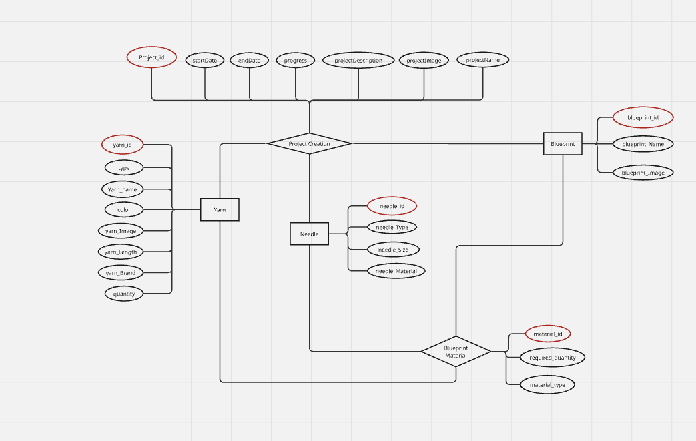
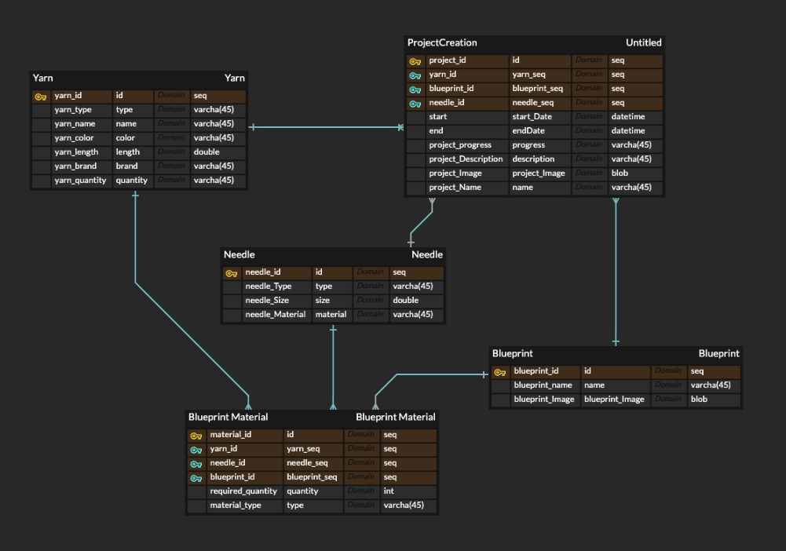

# Yarn Manager App
A web application for managing knitting materials like yarn and needles.

## Project Status
- Start Date: 2025-04-01
- Last Updated: 2025-04-06

### Today's Update
- Completed ERD design for database structure.
- Added ERD screenshot to README.

## Table of Contents
- [Overview](#overview)
- [Features](#features)
- [Technologies Used](#technologies-used)
- [ERD Design](#erd-design)

## Overview
Yarn Manager App is designed to help knitting enthusiasts manage their yarn inventory and track projects efficiently.

## Features
- Add and manage yarn and needles inventory.
- Track projects with progress updates.
- View required materials for each pattern.

## Technologies Used
Flutter & SQLite

## ERD Design
Below is the finalized ERD design for the database structure:

